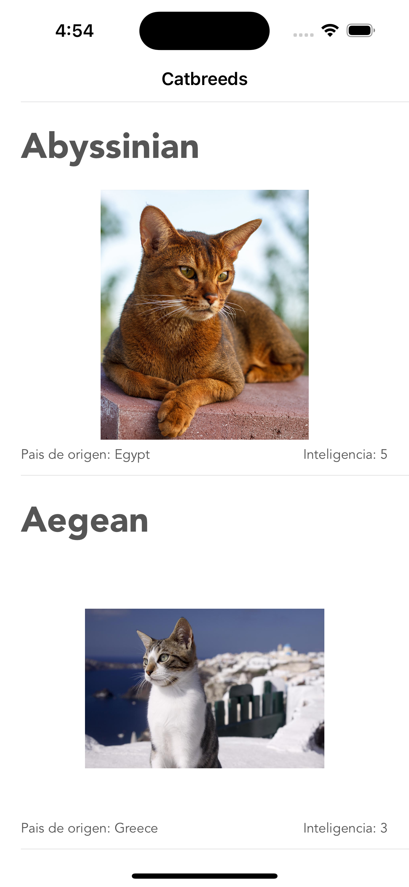
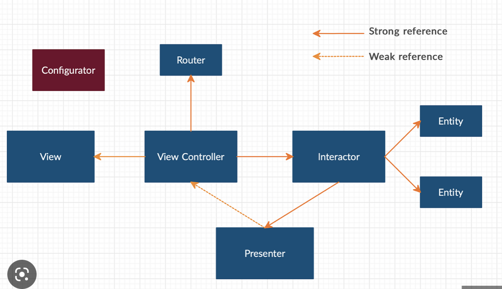
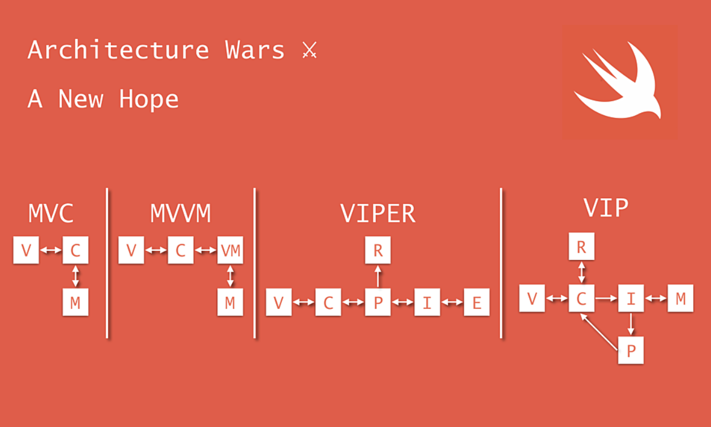

# Cats App

Proyecto IOS, implmentado en Swift 5+

## Screenshots Cats App 



## Requerimientos

**IOS:** 16 Swift 5+

**Dependencias:** Cocoapods

**Librerias externas:** RXSwift, RXCocoa, Moya, Nuke, RXBlocking


## Arquitectura

- La arquitectura utilizada es VIP, esta arquitectura es una modficación en pro de mejorar de la aquitectura VIPER, disminuyendo responsabilidades de algunas capas logicas ademas se disminuye la bidireccionalidad, entre las diferentes capas logicas.


## VIP



## VIPER



## Run App

Clone the project

```bash
  git clone https://github.com/jpipearagon/catsapp.git
```

Go to the project directory
